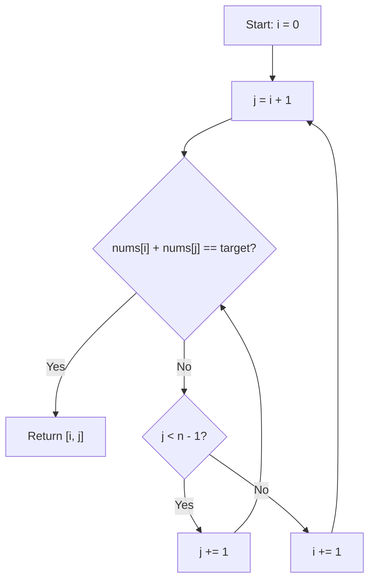
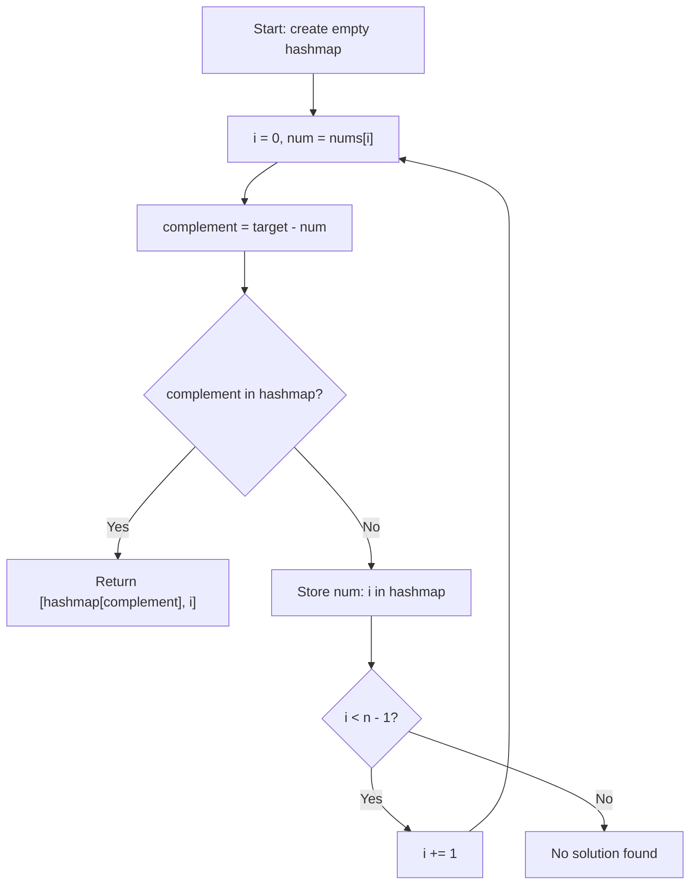

## Problem Summary

Given an array of integers and a target value, find two numbers in the array that add up to the target. Return the indices of these two numbers. Each input has exactly one solution, and you cannot use the same element twice.

---

## Approach 1: Brute Force

### Intuition

The simplest approach is to check every possible pair of numbers. For each element, scan through every other element to see if they add up to the target. This guarantees we find the answer, but it's slow because we check all pairs.

### Flow Diagram



### Python Solution

```python
class Solution:
    def twoSum(self, nums: list[int], target: int) -> list[int]:
        n = len(nums)
        for i in range(n):
            for j in range(i + 1, n):
                if nums[i] + nums[j] == target:
                    return [i, j]
        return []
```

### Java Solution

```java
class Solution {
    public int[] twoSum(int[] nums, int target) {
        int n = nums.length;
        for (int i = 0; i < n; i++) {
            for (int j = i + 1; j < n; j++) {
                if (nums[i] + nums[j] == target) {
                    return new int[]{i, j};
                }
            }
        }
        return new int[]{};
    }
}
```

### Complexity

- **Time:** O(n²) — nested loops check every pair
- **Space:** O(1) — no extra data structures

---

## Why This Isn't Good Enough

The nested loop checks every pair of numbers. With 10,000 elements, that's up to 50 million comparisons. The bottleneck is the inner loop — for each number, we're scanning the entire remaining array to find its complement. What if we could look up the complement instantly instead of scanning?

---

## Approach 2: Optimal (Hash Map)

### Intuition

Instead of searching for the complement with a nested loop, we use a hash map to remember every number we've seen so far. For each new number, we check if its complement (target - current number) already exists in the map. This gives us instant O(1) lookups, trading a small amount of space for a massive time improvement.

### Flow Diagram



### Python Solution

```python
class Solution:
    def twoSum(self, nums: list[int], target: int) -> list[int]:
        seen = {}
        for i, num in enumerate(nums):
            complement = target - num
            if complement in seen:
                return [seen[complement], i]
            seen[num] = i
        return []
```

### Java Solution

```java
class Solution {
    public int[] twoSum(int[] nums, int target) {
        Map<Integer, Integer> seen = new HashMap<>();
        for (int i = 0; i < nums.length; i++) {
            int complement = target - nums[i];
            if (seen.containsKey(complement)) {
                return new int[]{seen.get(complement), i};
            }
            seen.put(nums[i], i);
        }
        return new int[]{};
    }
}
```

### Complexity

- **Time:** O(n) — single pass through the array
- **Space:** O(n) — hash map stores up to n elements
