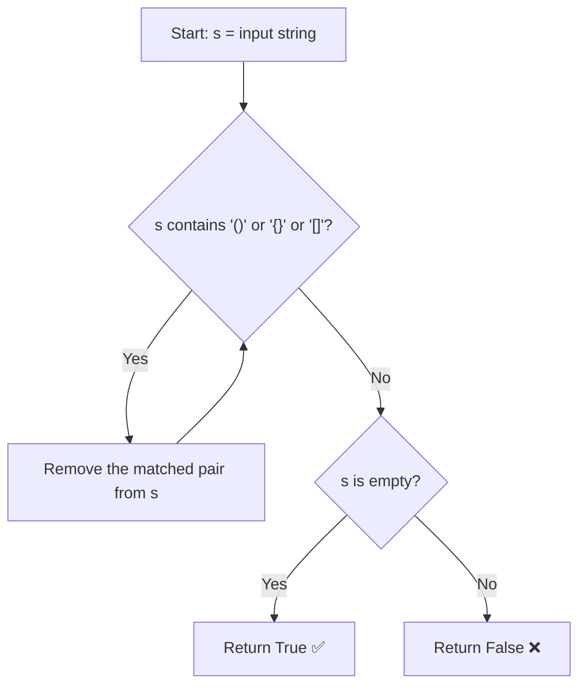
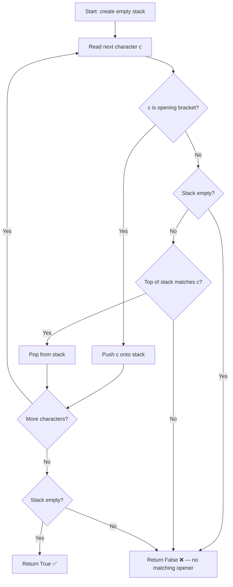

## Problem Summary

Given a string containing only the characters `(`, `)`, `{`, `}`, `[` and `]`, determine if the input string is valid. A string is valid if every opening bracket has a matching closing bracket of the same type, and brackets are closed in the correct order.

---

## Approach 1: Brute Force

### Intuition

Repeatedly scan the string and remove any adjacent matching pairs like `()`, `{}`, or `[]`. If the string becomes empty after all removals, it was valid. If no more pairs can be removed and the string is not empty, it's invalid.

### Flow Diagram



### Python Solution

```python
class Solution:
    def isValid(self, s: str) -> bool:
        while '()' in s or '{}' in s or '[]' in s:
            s = s.replace('()', '')
            s = s.replace('{}', '')
            s = s.replace('[]', '')
        return s == ''
```

### Java Solution

```java
class Solution {
    public boolean isValid(String s) {
        int prevLength = -1;
        while (s.length() != prevLength) {
            prevLength = s.length();
            s = s.replace("()", "");
            s = s.replace("{}", "");
            s = s.replace("[]", "");
        }
        return s.isEmpty();
    }
}
```

### Complexity

- **Time:** O(n²) — each pass scans and rebuilds the string, up to n/2 passes
- **Space:** O(n) — new strings created on each replacement

---

## Why This Isn't Good Enough

Each `replace()` call scans the entire string and creates a new one. For deeply nested inputs like `((((()))))`, we remove one pair per pass — that's n/2 passes over a string of length n. The real problem is that we keep rescanning characters we've already validated. A stack lets us process each character exactly once.

---

## Approach 2: Optimal (Stack)

### Intuition

Use a stack to keep track of unmatched opening brackets. When we encounter an opening bracket, push it onto the stack. When we encounter a closing bracket, check if the top of the stack is the matching opening bracket — if so, pop it off. If not, the string is invalid. At the end, the stack should be empty.

### Flow Diagram



### Python Solution

```python
class Solution:
    def isValid(self, s: str) -> bool:
        stack = []
        matching = {')': '(', '}': '{', ']': '['}
        for char in s:
            if char in matching:
                if not stack or stack[-1] != matching[char]:
                    return False
                stack.pop()
            else:
                stack.append(char)
        return len(stack) == 0
```

### Java Solution

```java
class Solution {
    public boolean isValid(String s) {
        Deque<Character> stack = new ArrayDeque<>();
        Map<Character, Character> matching = Map.of(
            ')', '(',
            '}', '{',
            ']', '['
        );
        for (char c : s.toCharArray()) {
            if (matching.containsKey(c)) {
                if (stack.isEmpty() || !stack.peek().equals(matching.get(c))) {
                    return false;
                }
                stack.pop();
            } else {
                stack.push(c);
            }
        }
        return stack.isEmpty();
    }
}
```

### Complexity

- **Time:** O(n) — single pass through the string
- **Space:** O(n) — stack stores up to n/2 opening brackets in the worst case
