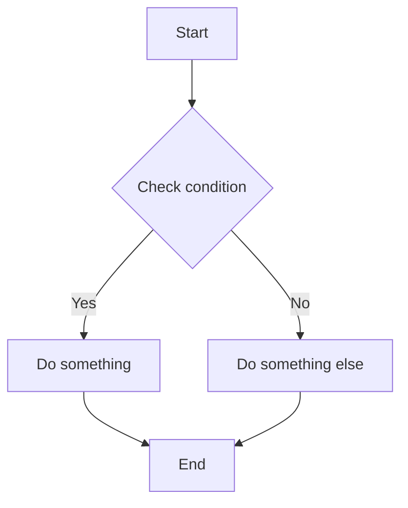
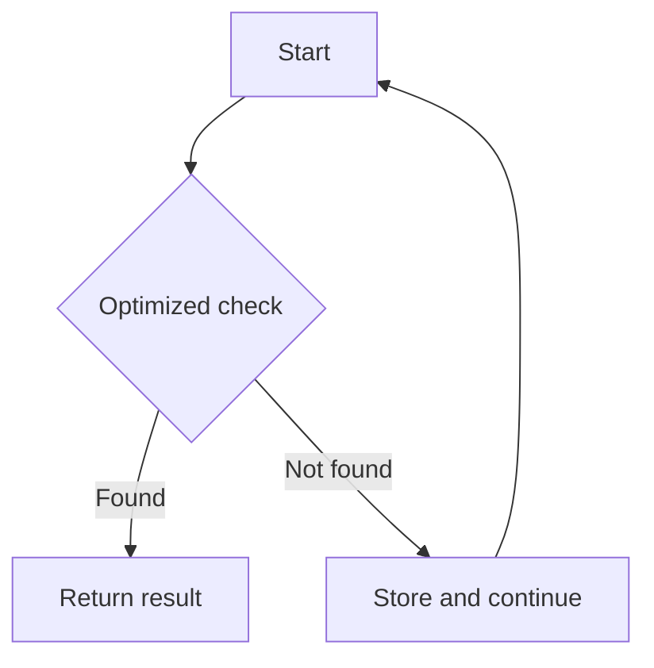

## Problem Summary

_Write a concise summary of the problem in your own words. Do NOT copy from LeetCode._

---

## Approach 1: Brute Force

### Intuition

_Explain the naive thinking. Why does this approach come to mind first?_

### Flow Diagram



### Python Solution

```python
class Solution:
    def solveProblem(self, nums):
        # Your brute force solution
        pass
```

### Java Solution

```java
class Solution {
    public int solveProblem(int[] nums) {
        // Your brute force solution
        return 0;
    }
}
```

### Complexity

- **Time:** O(n²)
- **Space:** O(1)

---

## Why This Isn't Good Enough

_Explain why the brute force is suboptimal. What's the bottleneck? What insight leads to a better approach?_

---

## Approach 2: Optimal

### Intuition

_Explain the key insight that makes this approach better._

### Flow Diagram



### Python Solution

```python
class Solution:
    def solveProblem(self, nums):
        # Your optimal solution
        pass
```

### Java Solution

```java
class Solution {
    public int solveProblem(int[] nums) {
        // Your optimal solution
        return 0;
    }
}
```

### Complexity

- **Time:** O(n)
- **Space:** O(n)
